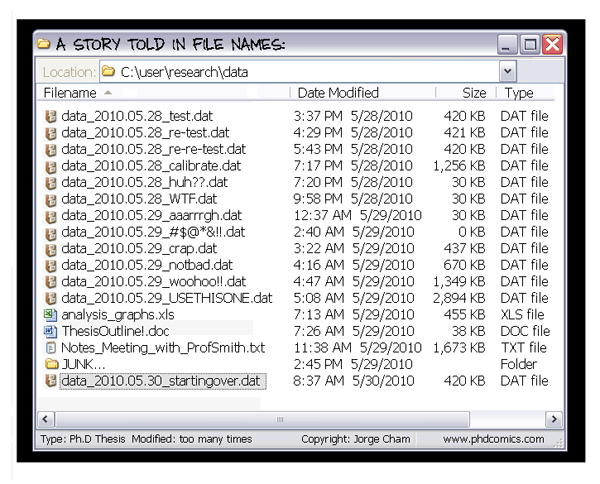
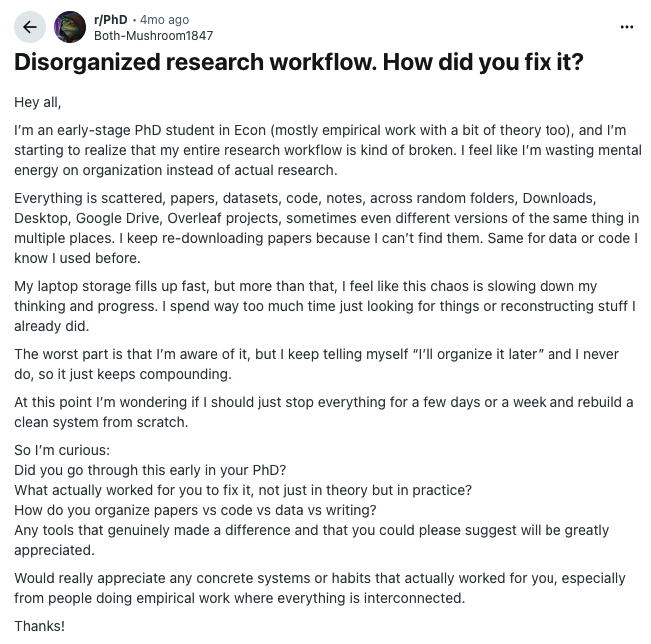
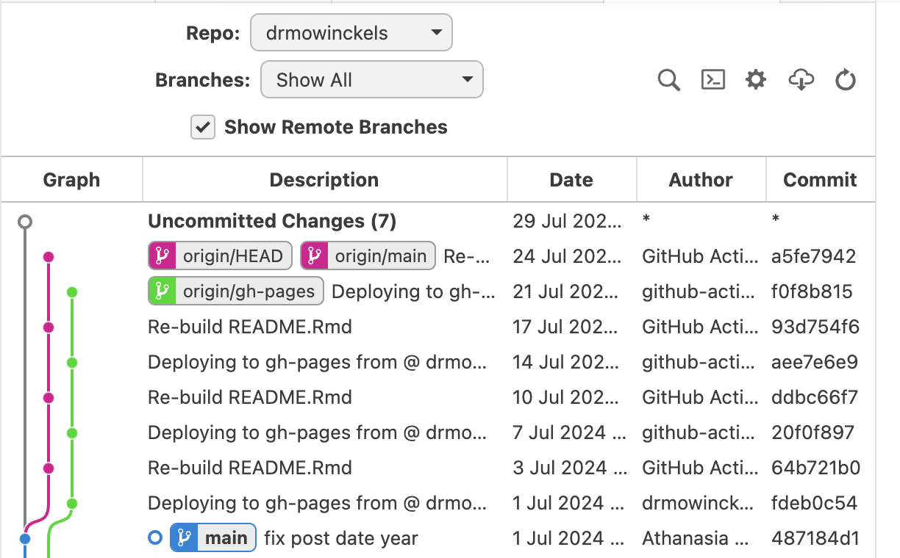
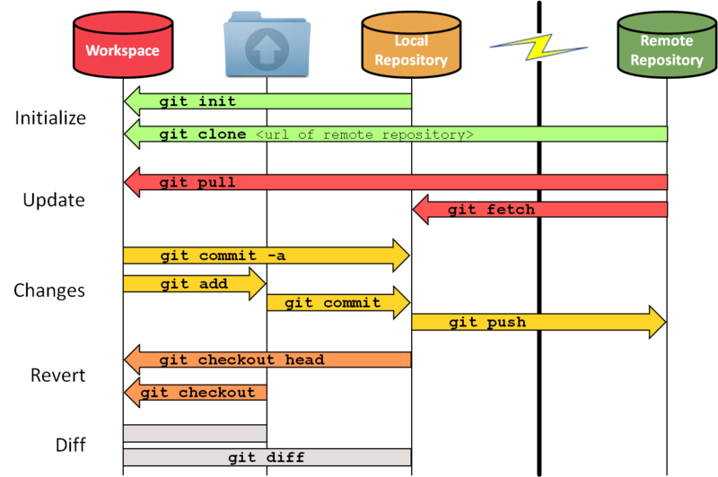
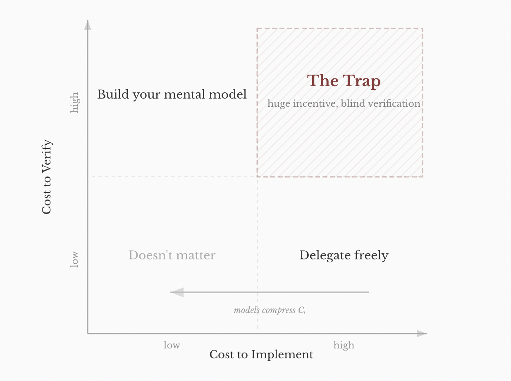

## Coding objectives of the course

**Goal:** prepare you for successful data analysis work - beyond register-based research

::: incremental
-   Good data analysts aren't just good modelers
-   Technical and practical skills
-   This course: coding basics, project maintenance, and how to use resources
:::

## Logistics

::: incremental
-   **Language:** R, written and run in Positron
-   **Format:** scripts are Quarto (`.qmd`) files
-   **First half of demos:** basic data management
-   **Second half of demos:** plots, tables, and reproducible scripts
:::

## What can go wrong ...

{fig-align="center" width="55%"}

::: {style="font-size: 0.62em; margin-top: 0.6em;"}
Jorge Cham, *PHD Comics* — [phdcomics.com](https://phdcomics.com)
:::

## Characteristics of good data analysis

::: incremental
-   It is **clear** and easy to understand
-   Results are **reproducible**
-   Code is written to be **flexible** for future iterations
-   Analysis is **efficient**, both in how it's written and how it runs
-   Outputs are **verified** to do what they're supposed to
:::

::: fragment
*Would a new collaborator (or you in 6 months) know how to reproduce this analysis?*
:::

## Data project checklist

```{=html}
<div class="checklist wide">
  <div class="cl-box cl-setup fragment">Good setup</div>
  <div class="cl-box cl-doc fragment">Good documentation</div>
  <div class="cl-box cl-code fragment">Good code</div>
</div>
```

## Data project checklist {.smaller}

:::::: columns
::: {.column width="38%"}
```{=html}
<div class="checklist">
  <div class="cl-box cl-setup">Good setup</div>
  <div class="cl-box cl-doc cl-dim">Good documentation</div>
  <div class="cl-box cl-code cl-dim">Good code</div>
</div>
```
:::

:::: {.column width="62%"}
::: incremental
-   Project organization:
    -   Folders and file names
-   Code versioning: Git
-   R code syntax: Air
:::
::::
::::::

## Data project checklist {.smaller}

:::::: columns
::: {.column width="38%"}
```{=html}
<div class="checklist">
  <div class="cl-box cl-setup cl-dim">Good setup</div>
  <div class="cl-box cl-doc">Good documentation</div>
  <div class="cl-box cl-code cl-dim">Good code</div>
</div>
```
:::

:::: {.column width="62%"}
::: incremental
-   Thorough code commenting
-   Data dictionaries
-   READMEs
:::
::::
::::::

## Data project checklist {.smaller}

:::::: columns
::: {.column width="38%"}
```{=html}
<div class="checklist">
  <div class="cl-box cl-setup cl-dim">Good setup</div>
  <div class="cl-box cl-doc cl-dim">Good documentation</div>
  <div class="cl-box cl-code">Good code</div>
</div>
```
:::

:::: {.column width="62%"}
::: incremental
-   File paths at top of script
-   Analysis files render successfully
-   Functions and loops: flexibility
-   Efficiency: parquet and arrow
:::
::::
::::::

## Why focus on this?

{fig-align="center" height="570px"}

## Good setup - Project organization {.smaller}

Every analysis should live in its own folder with a predictable structure:

:::::: columns
::: {.column width="45%"}
```         
project/
    ├── README.md
    ├── code/
    │   ├── _functions.R
    │   ├── 0_read_data.qmd
    │   ├── 1_clean_socioeconomics.qmd
    │   └── 2_build_analysis_file.qmd
    ├── data/
    │   ├── raw/
    │   └── processed/
    │       └── 1_socioeconomics/
    │       └── 2_analysis/
    └── results/
```
:::

:::: {.column width="55%"}
::: incremental
-   `code/` — scripts, **numbered** in the order they run
-   `data/raw/` — read-only data from your source
-   `data/processed/` — what your code produces
-   `results/` — plots and tables for a paper or presentation
-   `README.md` — what the project is and how to run it
:::
::::
::::::

The course folder follows the same convention.

## Good setup - Project organization {.smaller}

:::::: columns
:::: {.column width="50%"}
::: incremental
-   If you're going to rerun a script, you should **version** it
-   Date-based folders is one option, `v1,...,vn` another
-   Keeps you from losing track of revisions
:::
::::

::: {.column width="50%"}
```         
data/processed/2_analysis/
    ├── 20260901/
    │   └── analysis_file.parquet
    └── 20260915/
        └── analysis_file.parquet
```
:::
::::::

::: {style="font-size: 0.75em; margin-top: 0.7em;"}
**Want a second opinion on folder structure?** A similar convention, with slightly different names: [kdestasio.github.io/post/r_best_practices](https://kdestasio.github.io/post/r_best_practices/)
:::

## Good setup - Git {.smaller}

Git is a **version control system** that tracks file changes as code develops.

::: incremental
-   Course materials distributed via Git
-   Best practice in research and industry
-   **Goal in this class:** get comfortable with Git for personal tracking
-   Course covers basics, will develop over time
:::

## Good setup - Git: history over time {.smaller}

:::::: columns
::: {.column width="55%"}
{fig-align="center" width="100%"}
:::

:::: {.column width="45%"}
::: incremental
-   **Commit:** an annotated snapshot at a specific point in time
-   **Branch:** a stream of work that lets you experiment from current code or collaborate
-   Main benefit is to see changes over time, go back in time when necessary
:::
::::
::::::

## Good setup - Git: structure {.smaller}

:::::: columns
::: {.column width="55%"}
{fig-align="center" width="100%"}
:::

:::: {.column width="45%"}
::: incremental
-   **Remote:** Published version of the repository
-   **Local:** The version of the repo that Git tracks on your machine
-   **Workspace** The folder on your computer where you make changes
:::
::::
::::::

## Good setup - Air {.smaller}

Like writing, code is easier to understand and test if it follows a consistent grammar and structure. One way to build this into your R code is with [Air](https://posit-dev.github.io/air/).

::::: columns
::: {.column width="50%"}
**What you type**

``` r
x=c(1,2,3)
y<-  mean(x)
if(y>0){
    print( "positive" )
}
```
:::

::: {.column width="50%"}
**What Air saves**

``` r
x <- c(1, 2, 3)
y <- mean(x)
if (y > 0) {
  print("positive")
}
```
:::
:::::

::: incremental
-   Automatically applies consistent spacing, indentation, and style
-   Makes code easier to read, for you and for anyone else who opens your script
-   Set up to run **on save** in this course's project — your files are formatted for you
:::

## AI tools and coding {.smaller}

The new AI tools for coding may make it easier to generate code, but they make it **much harder** to verify. This makes many of the skills we teach you in this class even more important.

:::::: columns
::: {.column width="55%"}
{fig-align="center" width="100%"}
:::

:::: {.column width="45%"}
::: incremental
-   Knowing what changes over time in your files
-   Being able to see how data changes between operations
-   Having clear documentation about how you transform your data
:::
::::
::::::

## Resources and how to work with them

::: incremental
-   [Posit cheatsheets](https://github.com/rstudio/cheatsheets) — dplyr, ggplot2, quarto, purrr
-   [R for Data Science (2e)](https://r4ds.hadley.nz/) — Wickham, Çetinkaya-Rundel & Grolemund
-   [Modern R Programming: Data Visualization](https://rkabacoff.github.io/datavis/index.html) — Kabacoff
-   [Fundamentals of Data Visualization](https://clauswilke.com/dataviz/) — Wilke
:::