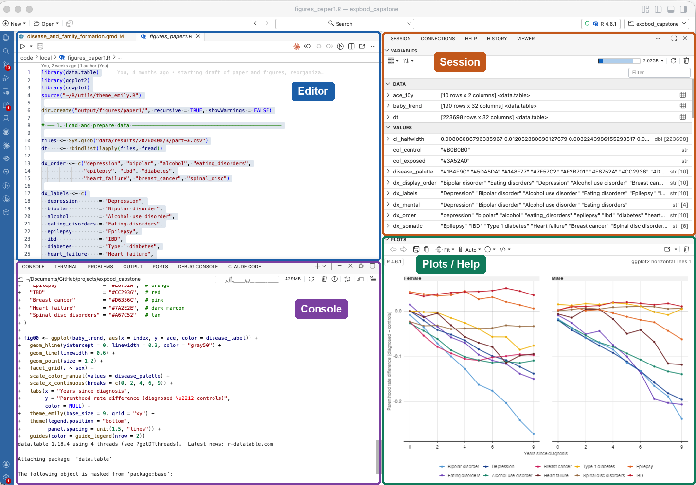

## Before the first session

You need to install the following and bring a working setup:

## 1. Install R

R is a free and open-source **software language** developed for statistical computing and graphics. It is a highly used language for research, econometrics, and data science work, and it's what we will use in this course and in the rest of the program.

Download R software here: [mirrors.dotsrc.org/cran](https://mirrors.dotsrc.org/cran/). You should download the most recent one (4.6.1 as of 13th July 2026).

The main homepage for R, including FAQs etc., is here: [r-project.org](https://www.r-project.org/).

## 2. Install Positron

Positron is the **integrated development environment (IDE)** we will use in this course. It was developed by the makers of RStudio, and has similar functionality and some add-ons. Positron was built off of VSCode, so if you've used VSCode you'll find it familiar. Positron is advantageous because it is built for data science work, so it is optimized for data processing, visualizing plots, and seeing the contents of your directories.

Install positron here: [positron.posit.co/download](https://positron.posit.co/download).

There are many bells and whistles in Positron which should make many different parts of your work easier.

### What you will see when you open Positron

{fig-align="center" width="100%" fig-alt="The Positron window with its four main panes outlined and labelled: Editor at the top left showing an open R script, Console at the bottom left showing code output, Session at the top right listing the objects in memory, and Plots / Help at the bottom right showing a figure."}

The first time you open Positron, it finds your R installation on its own. The window is divided into four main panes:

-   **Editor** (top left): where you write and save scripts and documents. Files open here as tabs.
-   **Console** (bottom left): where code runs. You can type code directly here and press Enter, or send it from the editor.
-   **Session** (top right): the Variables tab lists every object currently in memory, and the Data Explorer opens any dataset for browsing.
-   **Plots / Help** (bottom right): figures appear here when you make them, and documentation appears when you look up a function.

You do not need to learn these now — we walk through them in the first session.

### The command palette and the Terminal

Two parts of Positron are worth finding before the first session, because the rest of this guide uses them.

The **command palette** reaches every command in Positron without hunting through menus. Press **Cmd+Shift+P** (Mac) or **Ctrl+Shift+P** (Windows), start typing the name of what you want, and pick it from the list. We use it to download the course material and to render documents.

The **Terminal** is where you type instructions to your computer directly, rather than to R. Open it with **Ctrl+`** — the backtick key, top left of the keyboard, and it is Ctrl on both Mac and Windows — or from the menu with **View → Terminal**. It opens as a tab next to the Console. You need it twice in this guide and rarely after that.

## 3. Install Git

Git is a **version control system**. It keeps a full history of every change you make to a file, so you can see what you changed and when, go back to an earlier version, and work on the same project from more than one machine. It is the standard tool for managing code in research and in industry, and we use it here to distribute the course materials to you.

**On Windows:** download Git from [git-scm.com/downloads](https://git-scm.com/downloads) and accept the default options in the installer.

**On macOS:** you may already have Git. Open the Terminal and type `git --version`. If you get a version number, you are done. If macOS offers to install the Command Line Tools, accept, and that installs Git for you.

If neither works, install Git with **Homebrew**, a package manager for macOS. Paste this into the Terminal and follow the prompts:

```{bash}
#| eval: false
/bin/bash -c "$(curl -fsSL https://raw.githubusercontent.com/Homebrew/install/HEAD/install.sh)"
```

Homebrew finishes by printing two or three extra commands under a heading like *Next steps*. Run those as well, then close and reopen the Terminal. Now install Git:

```{bash}
#| eval: false
brew install git
```

Once Git is installed, tell Git who you are. This is a one-time setup.

```{bash}
#| eval: false
git config --global user.name "Your Name"
git config --global user.email "your@email.com"
```

We will not use Git in depth in this course, and you do not need to know it well. You need it to keep the course materials up to date when I add something new (see section 4), and later in the course to track your own work.

## 4. Get the course material

All course material — slides, demos, exercises, and assignments — lives in a Git repository on GitHub. You get your own copy by **cloning** the repository, which you only do once. After that, one command each week brings in whatever I have added.

In Positron, open the command palette (**Cmd+Shift+P** / **Ctrl+Shift+P**), type `Git: Clone`, and press Enter. Paste this address when it asks for the repository URL:

```
https://github.com/ekjohnsonphd/intro-to-sundhedsdata-course.git
```

Positron will then suggest a folder to download material in, which you can change at this point. When the download finishes, choose to open the folder.

The data is not in the repository. Download the data files from itslearning and unzip them at the top level of the course folder you just cloned, so that the files land in `data/raw/` and `data/processed/`.

In the first session we look at how to pull new material each week. If you cannot get Git working, the first week's material is also posted on itslearning — bring the problem to the first session and we will sort it out there.

Assignments are submitted through itslearning.

## 5. Quarto

Quarto is a **file format** and **publishing platform**. It is like a combination of Word, PowerPoint, Jupyter Notebooks, R Markdown, and Overleaf all in one. All of the slides, demos, and assignments are in Quarto format, and you can also use Quarto to write papers, make websites, or produce documents which you can convert to pdf, word, powerpoint, or latex.

Quarto comes with Positron, so there is nothing to install.

Quarto uses **markdown** syntax for formatting text and writing equations. There are many resources for writing markdown online, including the [Markdown cheatsheet](https://www.markdownguide.org/cheat-sheet/).

### What a Quarto document looks like

A Quarto document is a plain text file ending in `.qmd`, with three ingredients:

1.  A **YAML header** at the top, between two `---` lines: the title, author, and output format.
2.  **Text**, written in markdown: `##` makes a heading, `**bold**` makes bold text, `-` makes a bullet.
3.  **Code chunks**, between ```` ```{r} ```` fences: R code that runs when the document is rendered, with its output placed directly below.

Here's an example of a complete qmd document:

```` markdown
---
title: "My first document"
format: html
---

## A heading

Some text about the analysis.

```{{r}}
1 + 1
```
````

### Rendering

**Rendering** turns the `.qmd` file into a finished document. If you have used R Markdown, this is the same thing as knitting.

Open the `.qmd` file in the editor, then open the command palette (**Cmd+Shift+P** / **Ctrl+Shift+P**) and choose **Quarto: Render Document**. Quarto runs every code chunk from top to bottom in a fresh R session, and writes the finished document next to the `.qmd` file.

**Quarto: Preview** (**Cmd+Shift+K** / **Ctrl+Shift+K**) does the same thing and opens the result in a pane beside your code, which is useful while you are still working on a document.

Because the session is fresh, rendering is also the way to check that your code runs on its own. This matters later in the course, when you hand in assignments as rendered documents.

### Rendering to PDF

Assignments are handed in as PDF. Producing a PDF needs LaTeX, which does not come with Positron. Install it once, from the Terminal:

```{bash}
#| eval: false
quarto install tinytex
```

This takes a few minutes. You only do it once.

## 6. Install R packages

We will use a number of **packages** in R to perform certain operations relevant for data management and visualization. A package is a bundle of functions that allow us to read data, modify it, save it, or use it in different models and plots.

Run the code below to install the packages required for the course. You will only need to do this once after R is installed.

```{r}
#| eval: false
install.packages(c("tidyverse", "arrow", "haven", "gtsummary",
                   "GGally", "mosaicData",
                   "downlit", "xml2"))
```

## Check that everything works

Open Positron, paste the code below into the console, and press Enter. If the last line prints `"Everything works!"` with no errors above it, you are ready for the first session.

```{r}
#| eval: false
library(tidyverse)
library(arrow)
library(haven)
library(gtsummary)
library(GGally)
"Everything works!"
```

If you get an error instead, note which step it came from and bring it to the first session — the first thing we do is make sure everyone's setup runs.
