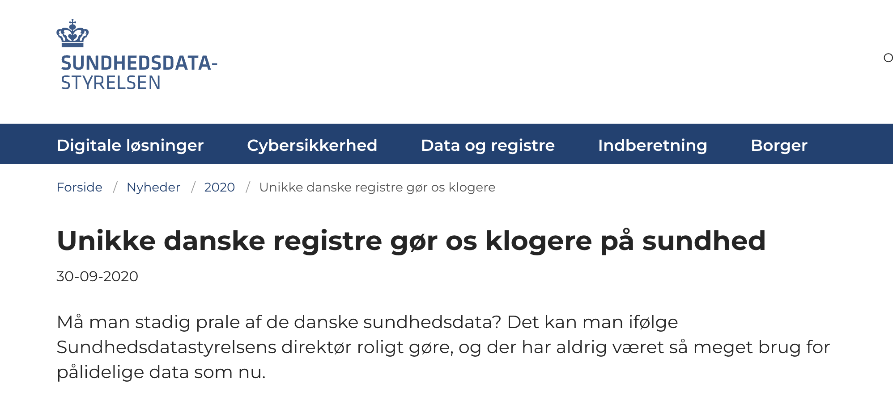
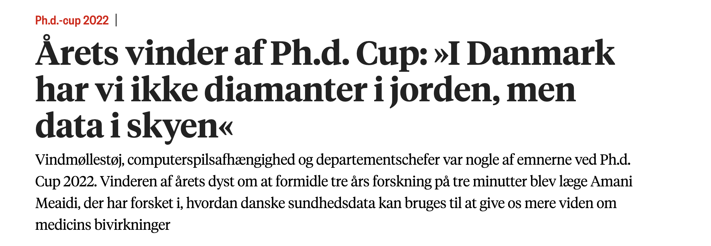
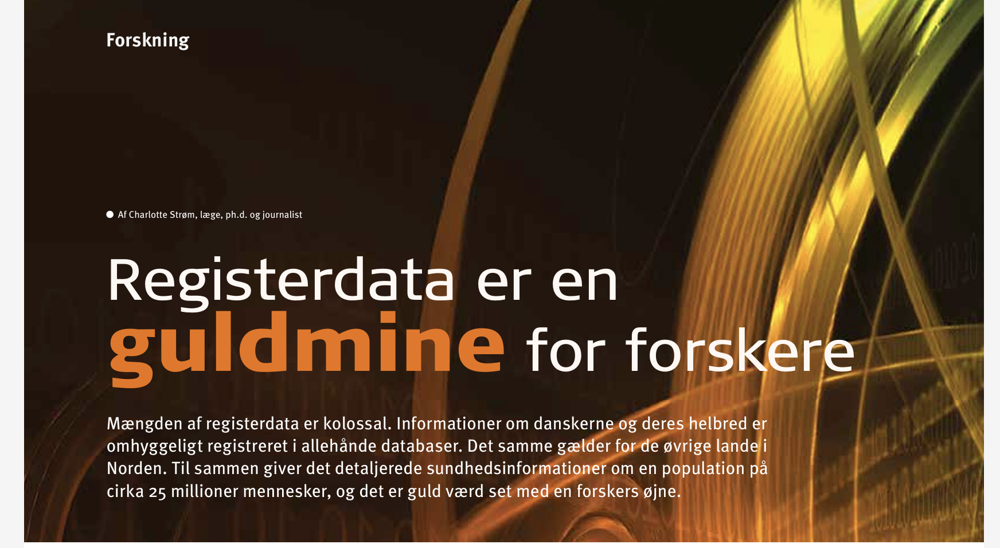
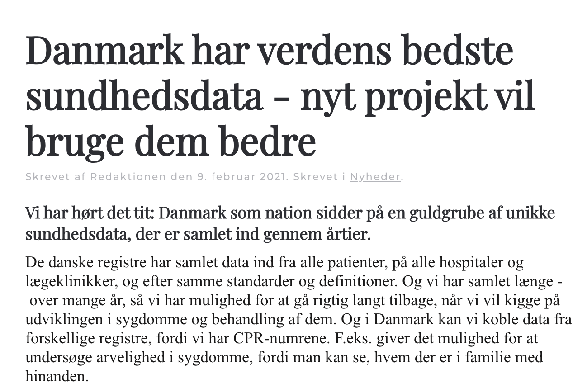
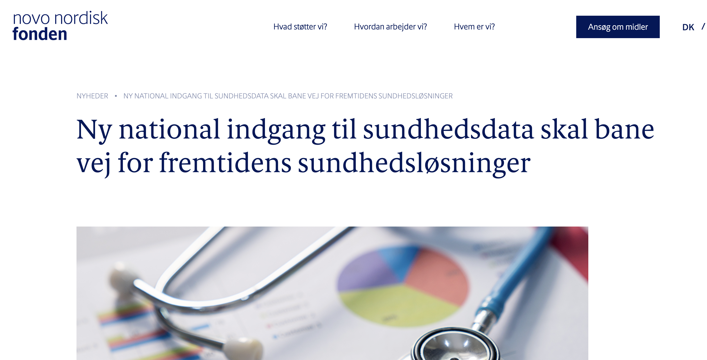
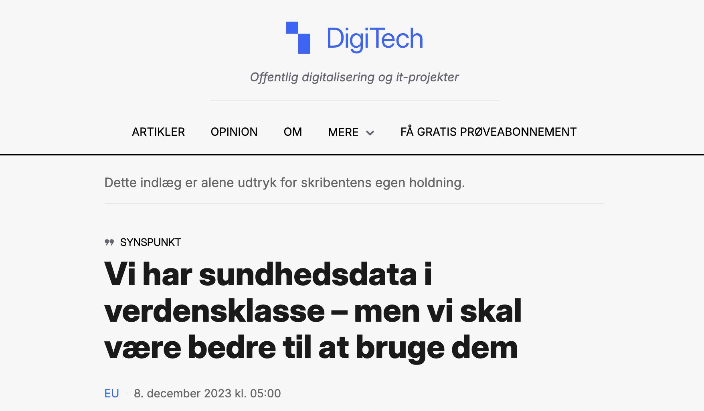
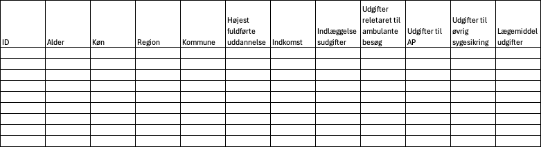

## Om faget

- Gennemgå lektionsplanen kort

## Indhold i lektion 1

- Introduktion til datakilder
- Data etik og GDPR
- Typer af data
- Introdukion til
  - Positron og
  - R

## Sundhedsdata

## Datakilder {.smaller}

- [DST Statistikbanken](https://www.statistikbanken.dk/statbank5a/default.asp?w=1440)
- [DST microdata](https://www.dst.dk/da/TilSalg/data-til-forskning)
- [Sundhedsdatabanken](https://sundhedsdatabank.dk/)
- [Sundhedsdatastyrelsens mikrodata](https://sundhedsdatastyrelsen.dk/data-og-registre/forskerservice)
- [SundK](https://www.sundk.dk/kliniske-kvalitetsdatabaser/)
- [SHARE](https://share-eric.eu/)
- [Sundhedsprofilerne](https://www.danskernessundhed.dk/)
- Kohortedata
  - Østerbroundersøgelsen
  - Inter99
  - VIA

::: {.notes}
Kort introduction til hver datakilde med et view på hjemmesiden
:::

## DST mikrodata – registre i dette fag

- Befolkningsregisteret
- Indkomstregistret
- Uddannelsesregistret
- Landspatientregisteret og DRG
- Sygesikringsregistret
- Lægemiddelregistret

{fig-align="center" width="80%"}

## GDPR

- Man skal altid have hjemmel til at behandle personoplysninger
- Hvad betyder det ?
- Personoplysninger skal behandles sikkert.
- Need to know
- Hvis man søger godkendelse til et formål, skal man søge på ny hvis formålet ændrer sig
- Forkerte oplysninger slettes
- Når man er færdig med sit projekt skal data slettes eller afleveres til Rigsarkivet
- Der er også noget der hedder OpenScience

## Typer af analysedata

- Cross section
- Time series data
- Paneldata / longitudinelle data
- Event / indexdata
- Survivaldata
- [LINK](../../resources/data%20typer.xlsx)
