## What is exploratory data analysis?

:::: columns
::: {.column width="38%"}
-   Build knowledge / intuition about your dataset by visualizing it
-   Essential for troubleshooting
-   Prerequisite for analysis
:::

::: {.column width="62%"}
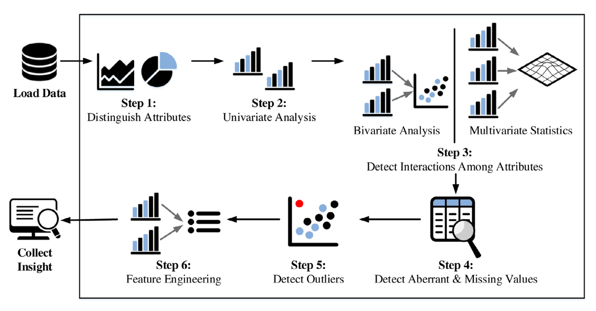

:::
::::

## Purpose of EDA

-   Informs modeling choice and handling of variables
-   Important to have enough background so that you can validate and troubleshoot analysis
-   Often the first thing a reader will want to see

## Best practices for EDA

-   Done **before** analysis starts
-   Built-in to data management
-   Fact-checking your intuition and pipeline:
    -   Are time trends in a variable stable over time, or do we see unexpected jumps?
    -   Is there missingness in this data?
    -   Do variables fall within an expected range?

## What makes a good EDA plot?

-   A figure answers one question at a time
-   Someone should be able to understand the figure without you explaining it:
    -   Descriptive title and axes legends
    -   Clear description of the data source, population represented
-   In line with good practices for data visualization

## Where to look things up

-   **R Graph Gallery** — many different chart types with R code: `r-graph-gallery.com`
-   **Kabacoff, *Data Visualization with R***
-   **ggplot2 cheat sheet**
-   Examples of great data visualization:
    -   The Economist's *Graphic Detail* — `economist.com/graphic-detail`
    -   *Our World in Data* — `ourworldindata.org`

# Univariate EDA {background-color="#1e2761"}

## Example: p-values in publication {.smaller}

:::: columns
::: {.column width="57%"}
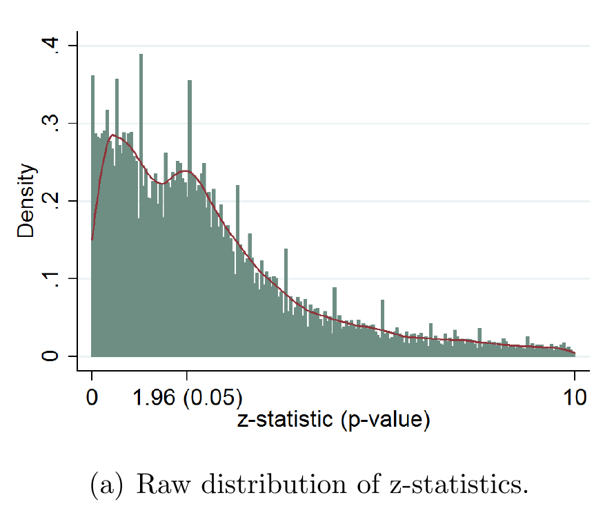

::: source
Every test statistic published in the *AER*, *JPE* and *QJE*, 2005–2011. Source: Brodeur, Lé, Sangnier & Zylberberg (2016), *Star Wars: The Empirics Strike Back*, AEJ: Applied 8(1), Figure 1(a).
:::
:::

::: {.column width="43%"}
Two phenomena in this plot:

-   **Spiky bars:** authors round, reporting `z = 2.00` rather than `z = 1.9973` — information about the data generating process
-   **The camel shape:** a dip just below 1.96 and a clump just above it — what does this tell us about which studies get published?
:::
::::

## Example: income in the registers {.smaller}

:::: columns
::: {.column width="57%"}
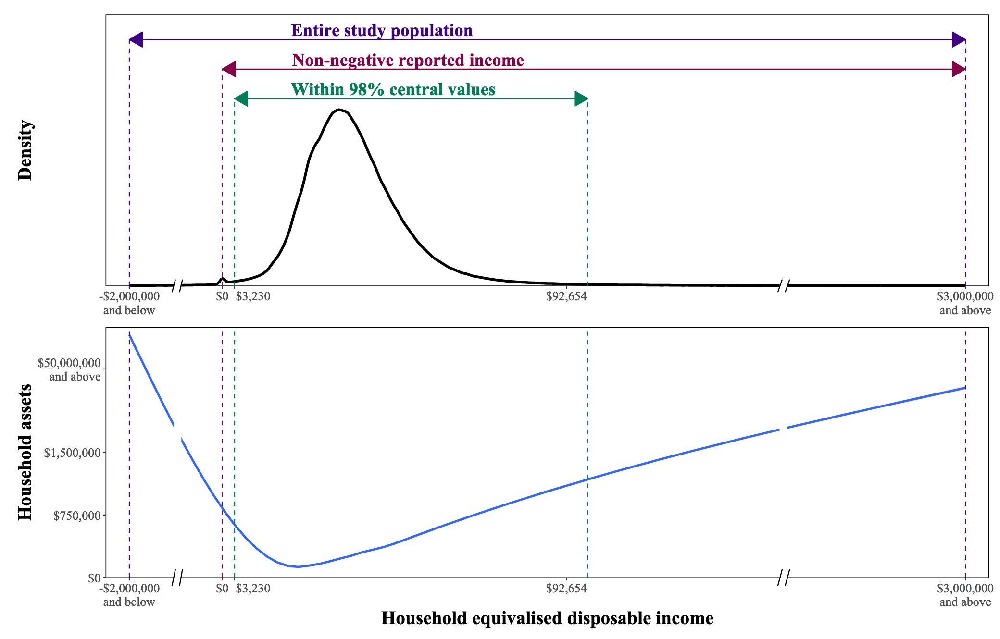

::: source
Source: Ejlskov & Plana-Ripoll (2025), *Income in epidemiological research*, J Epidemiol Community Health, Figure 1. Danish register data; caption cropped.
:::
:::

::: {.column width="43%"}
-   Middle 98%: **\$3,230** to **\$92,654**
-   Full range: **[–\$2M]{style="white-space: nowrap;"}** to **\$3M** — heavily skewed
-   Most negative income = most assets: capital and business losses, not poverty
-   Dropping negatives or trimming outliers changes the study population
:::
::::

## Continuous data: distribution plots

-   Distributional plots are sometimes enough to convey a story/message
-   Useful to build an intuition about the spread of data

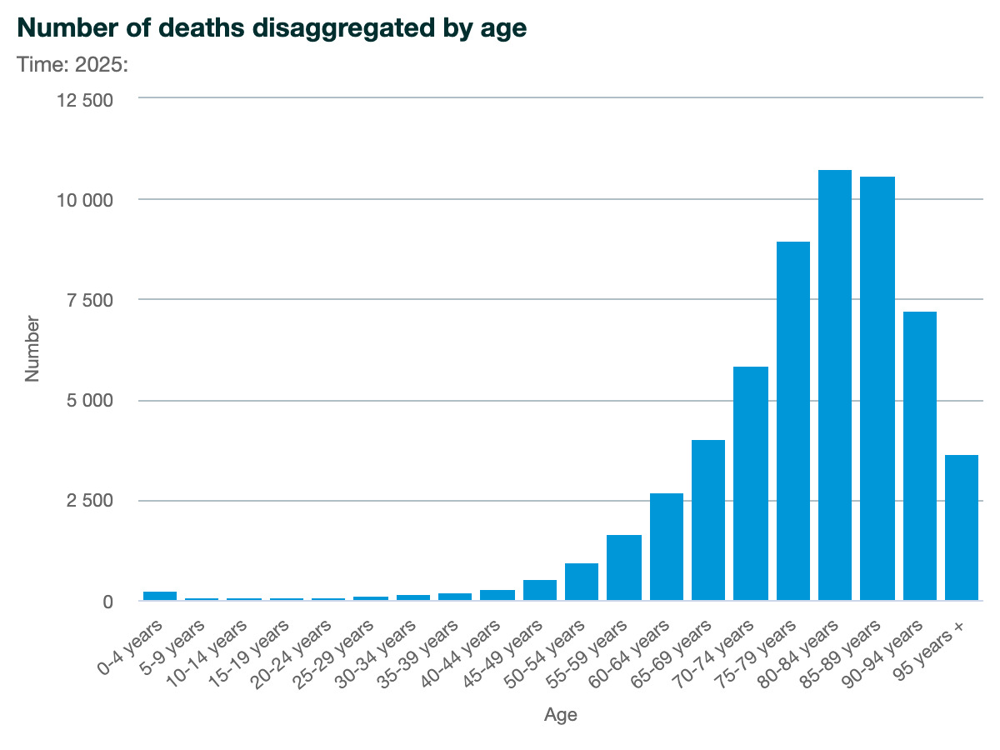{.nostretch fig-align="center" width="55%"}

## Continuous data: histograms

-   Histogram / density plot: show the distribution of a variable of interest
-   Example: age distribution of disease diagnoses, register data

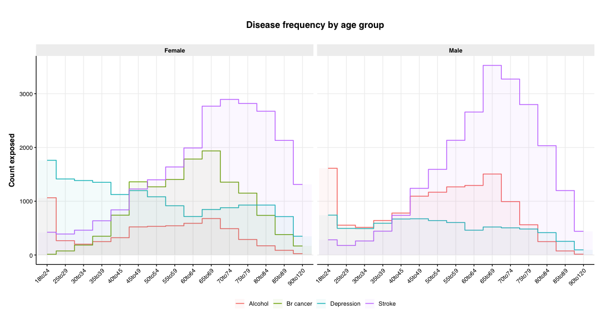{fig-align="center" height="380"}

## Continuous data: box plots

:::: columns
::: {.column width="55%"}

:::

::: {.column width="45%"}
-   Box plot: summarized plot which represents summary statistics in visual format
-   Proceed with caution: information gets lost
-   Best for comparing many distributions
:::
::::

## Continuous data: box plot alternatives

::::: columns
:::: {.column width="58%"}
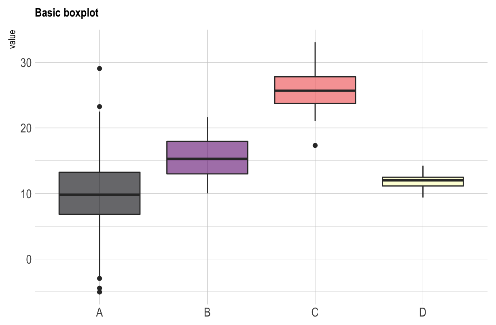{height="265"}

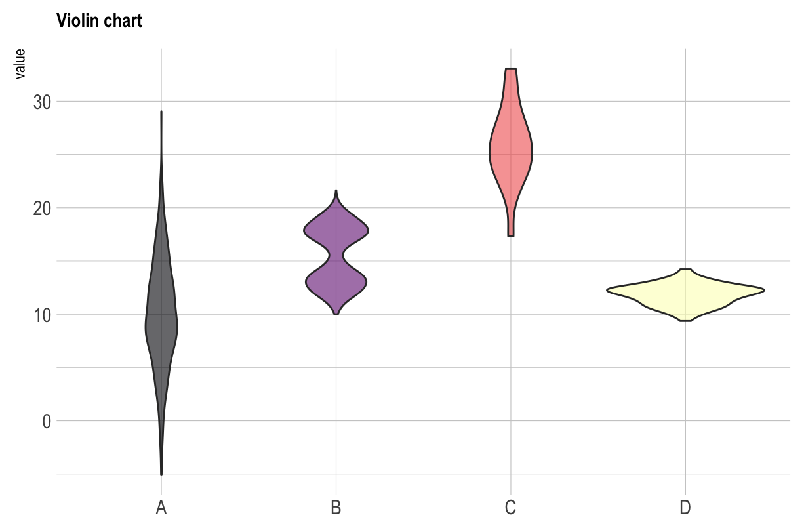{height="265"}
::::

:::: {.column width="42%"}
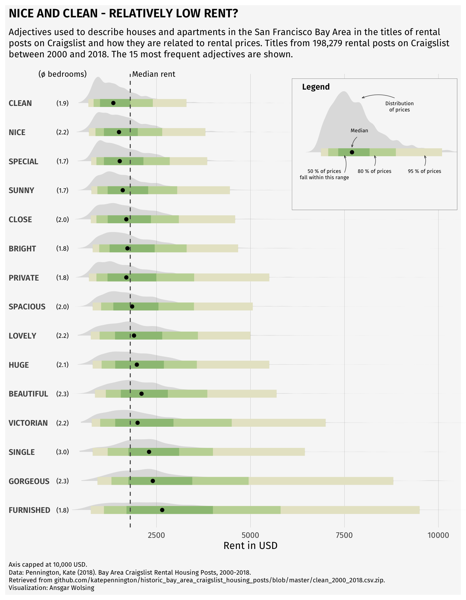{height="530"}

::: {style="font-size: 0.6em;"}
Ridge plot
:::
::::
:::::

## Categorical data: bar plots

:::: columns
::: {.column width="35%"}
-   Bar plot: represent frequency of category values
-   Added complexity
    -   Facets/groups
    -   Position
:::

::: {.column width="65%"}
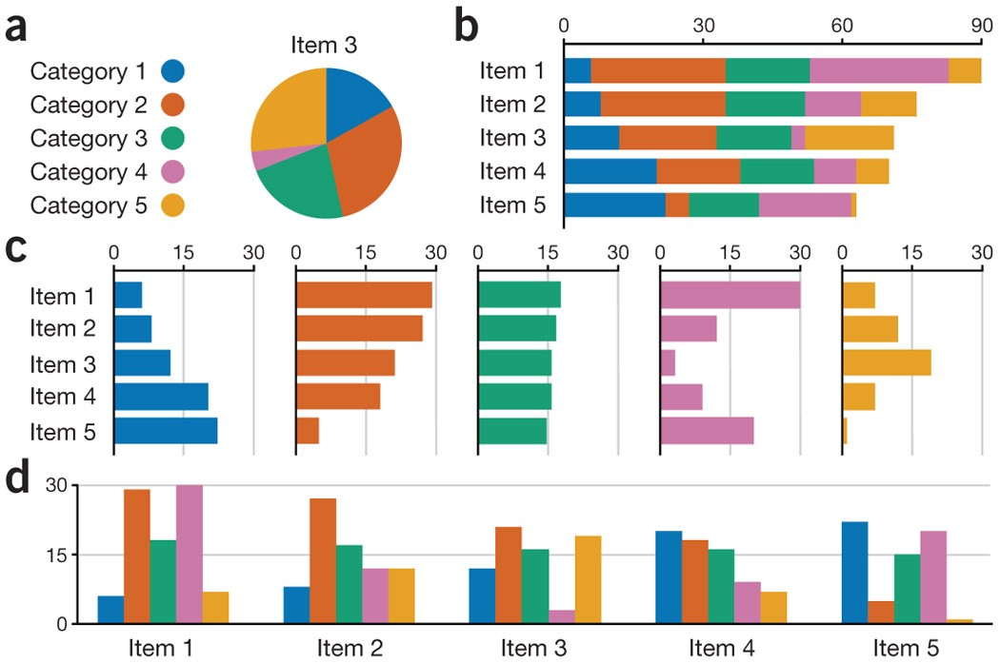

::: source
<https://www.nature.com/articles/nmeth.2807>
:::
:::
::::

## Categorical data: pie charts

:::: columns
::: {.column width="35%"}
-   Pie chart: represent categories as piece of a whole
-   Issue: visual discernment
:::

::: {.column width="65%"}
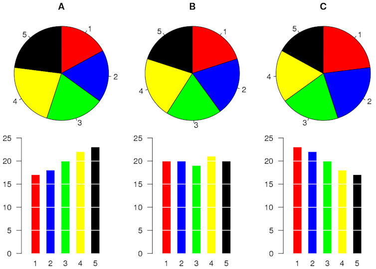

:::
::::

# Multivariate EDA {background-color="#1e2761"}

## Multivariate: comparisons and relationships

-   Investigate comparisons or relationships between variables:
    -   Comparison: sex differences and income
    -   Relationships: income levels over time
-   Visuals give more information than a correlation / coefficient
    -   Therefore essential for good analysis

## Multivariate: scatter plots

:::: columns
::: {.column width="38%"}
-   Also useful to compare before & after steps in a data processing pipeline
:::

::: {.column width="62%"}
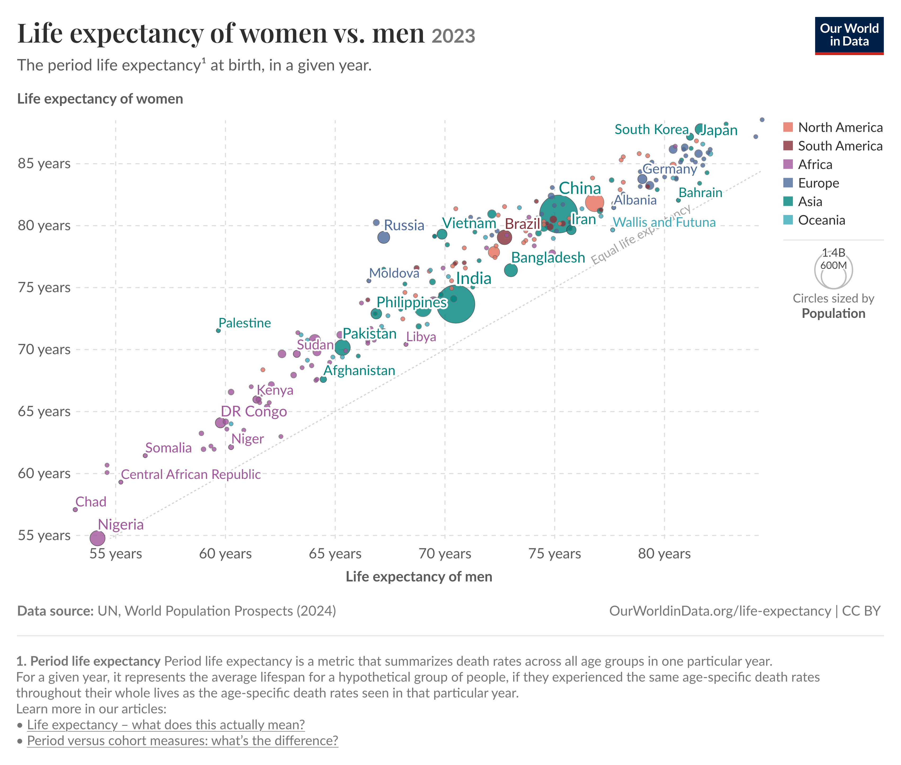
:::
::::

## Multivariate: stratification and grouping

:::: columns
::: {.column width="50%"}
-   Comparing distributions gives more information than summary statistics
-   Consider overlays, panels depending on expected overlap
:::

::: {.column width="50%"}
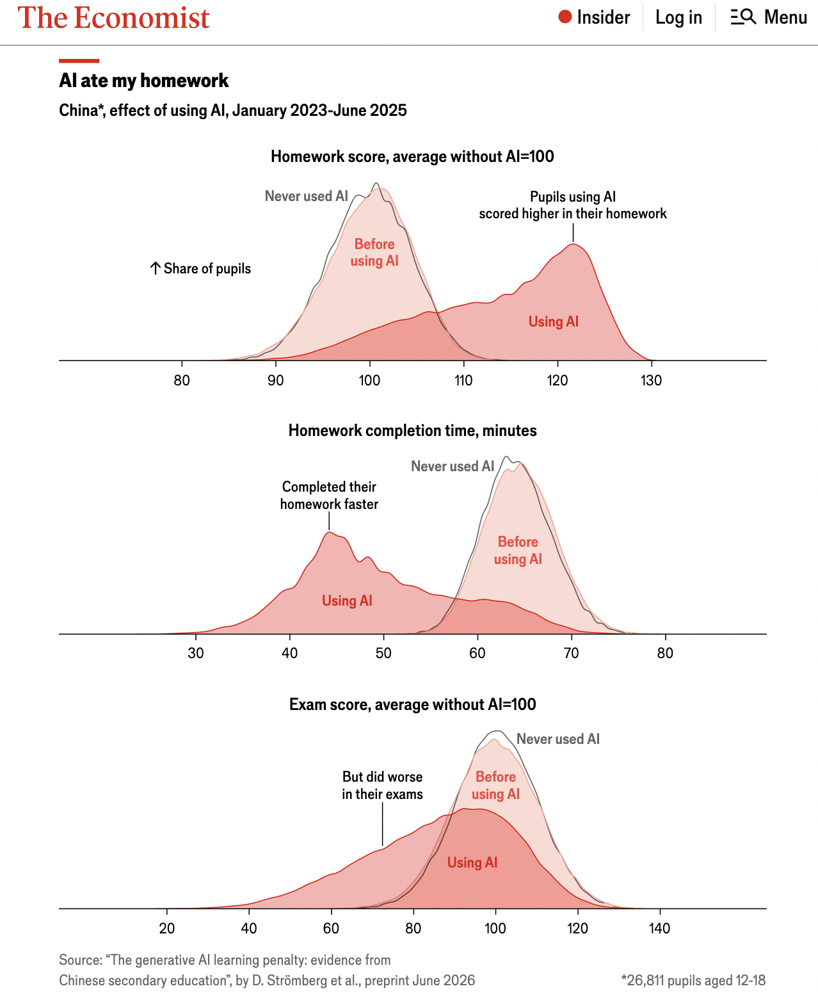{height="520"}
:::
::::

# Time series & panel data {background-color="#1e2761"}

## Time series: line plots

:::: columns
::: {.column width="62%"}
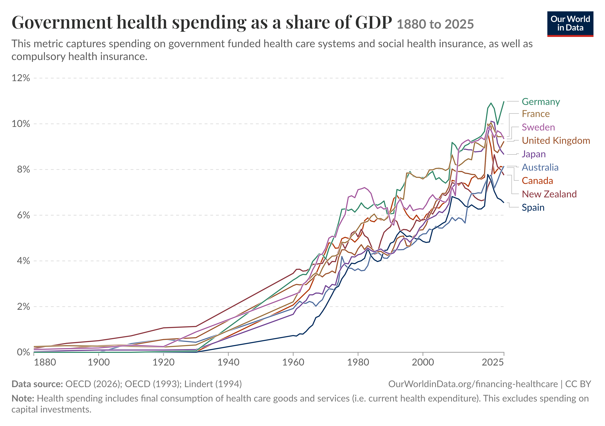
:::

::: {.column width="38%"}
-   Show continuity over time (age, etc.)
-   Also used for comparison like scatters
:::
::::

## Time series: ranking plots

:::: columns
::: {.column width="40%"}
-   Useful to show comparisons where a baseline changes over time
-   Somewhat uncommon in literature
:::

::: {.column width="60%"}
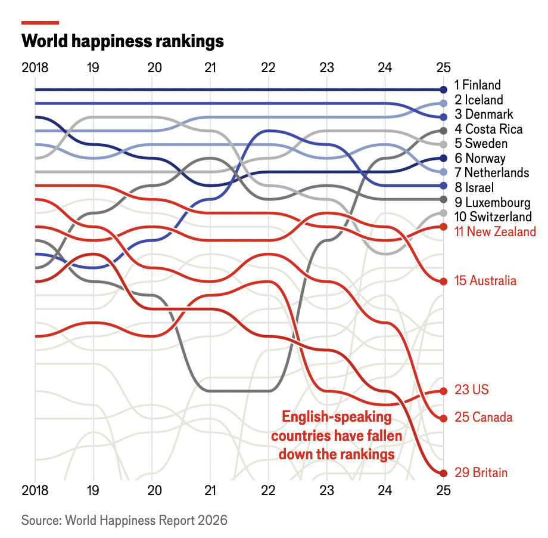{height="470"}

::: source
[https://www.economist.com/graphic-detail/2026/03/19/the-anglosphere-is-increasingly-miserable](https://www.economist.com/graphic-detail/2026/03/19/the-anglosphere-is-increasingly-miserable){style="word-break: break-all;"}
:::
:::
::::
